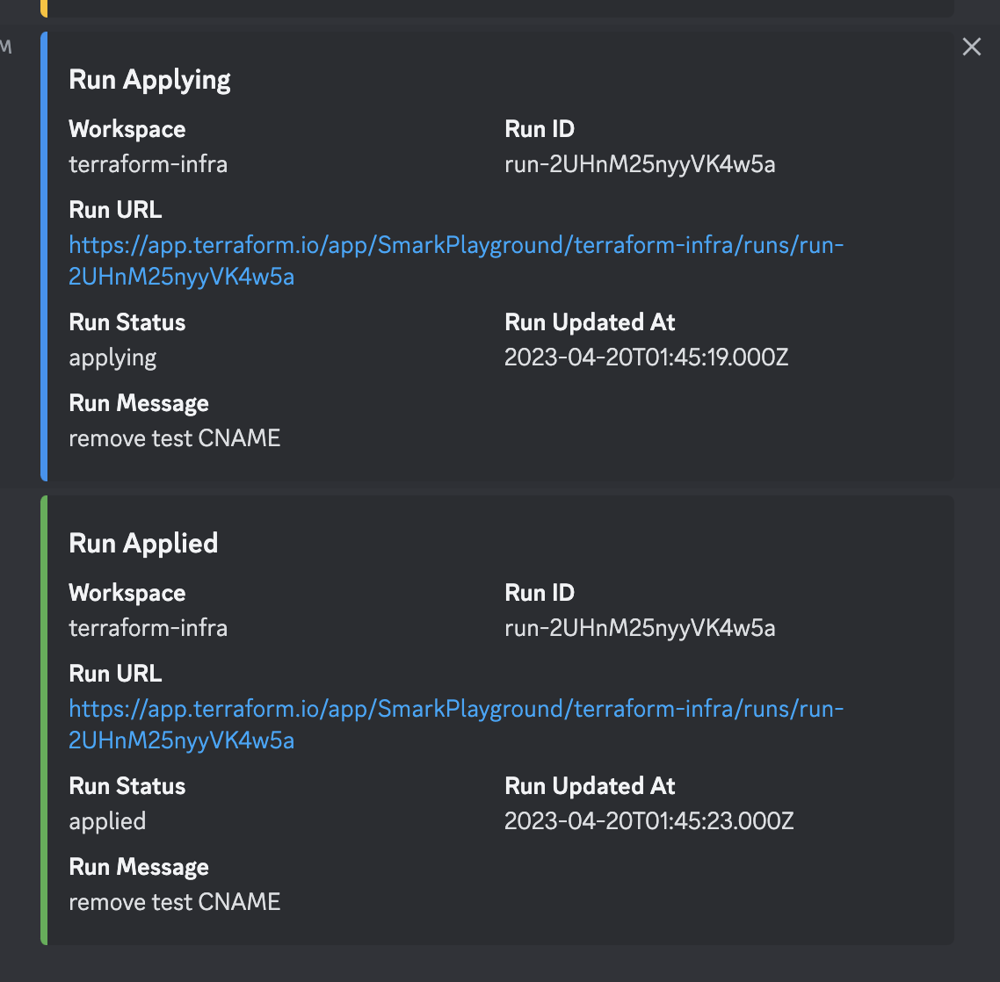

# Terraform Cloud Discord Webhook Proxy

Made using ChatGPT conversation (included this `README.md`) :heart:

This is a Golang application that listens for Terraform Cloud webhooks and sends formatted messages to a Discord webhook based on the webhook payload.



## Prerequisites

- [Terraform Cloud](https://app.terraform.io/) account
- [Discord](https://discord.com/) account
- [Golang](https://golang.org/) installed on your local machine or server
- [Docker](https://www.docker.com/) installed on your local machine or server (optional)
- [Docker Compose](https://docs.docker.com/compose/) installed on your local machine or server (optional)

## Setup

1. Create a Discord webhook for your server or channel. Follow the instructions in [this guide](https://support.discord.com/hc/en-us/articles/228383668-Intro-to-Webhooks) to create a webhook URL.

2. Set the `TF_DISCORD_PROXY_WEBHOOK_URL` environment variable to the Discord webhook URL:

    ```bash
    export TF_DISCORD_PROXY_WEBHOOK_URL=<your-discord-webhook-url>
    ```

3. (Optional) Set the `TF_DISCORD_PROXY_PORT` environment variable to the desired port number (default is `8080`):

    ```bash
    export TF_DISCORD_PROXY_PORT=<your-port-number>
    ```

4. Build and run the Golang application:

    ```bash
    go run main.go
    ```

    or

    ```bash
    docker run -p $TF_DISCORD_PROXY_PORT:8080 -e TF_DISCORD_PROXY_WEBHOOK_URL=$TF_DISCORD_PROXY_WEBHOOK_URL smark91/terraform-cloud-discord-webhook:<image-version>
    ```

5. In your Terraform Cloud workspace, create a notification configuration with the following settings:
- **Name:** Discord Webhook
- **Trigger:** All events
- **URL:** `<your-server-url>/webhook` (replace `<your-server-url>` with the URL of your server where the Docker container is running)

6. Create a new run in your Terraform Cloud workspace to trigger the webhook.

## Using Docker Compose

If you prefer to use Docker Compose to run the Terraform Cloud Discord webhook proxy, follow these steps:

1. Create a Discord webhook for your server or channel. Follow the instructions in [this guide](https://support.discord.com/hc/en-us/articles/228383668-Intro-to-Webhooks) to create a webhook URL.

2. Create a file named `docker-compose.yml` with the following contents:

   ```yaml
   version: '3'
   services:
     terraform-cloud-discord-webhook-proxy:
       image: smark91/terraform-cloud-discord-webhook-proxy:<image-version>
       ports:
         - "8080:8080"
       environment:
         - TF_DISCORD_PROXY_WEBHOOK_URL=<your-discord-webhook-url>
         # - TF_DISCORD_PROXY_PORT=8080
   ```

   Replace `<your-discord-webhook-url>` with the Discord webhook URL.

3. Run the following command to start the Docker Compose stack:

   ```bash
   docker-compose up -d
   ```
